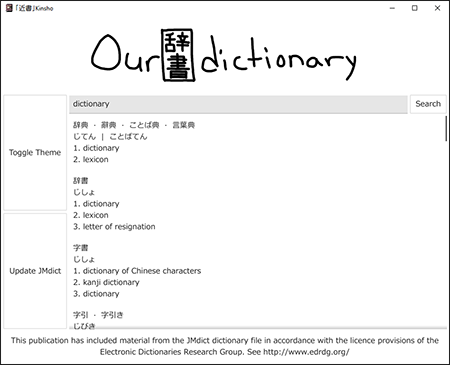
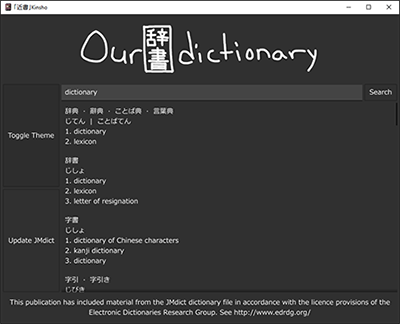

# 「近書」Kinsho 

「近書」Kinsho is a simple digital Japanse-English dictionary utilizing JMdict_e. The user can search for Japanese or English words and find the most common and accurate translation in the opposite language.
Japanese search terms can be written in kanji, hiragana and romaji, and will regardless produce the same results. The dictionary XML files are stored locally, as to not require the user to have internet access.

 

Additional features include the ability to switch between light mode and dark mode, and updating the dictionary in order to get the latest edition.

#### Minimum viable product
The MVP of this project is a product able to load JMdict_e, and parse through its contents. The user is able to use a search function to find relevant vocabulary and kanji using English or Japanese search terms. The program also has a simple graphical user interface.

#### Coding conventions
- Written in the language Go
- Using gofmt to structure the code according to the golang standards
- Variable names should be indicative of their purpose
- Using camelCase and PascalCase, for private and public access respectively

#### Acknowledgement
This publication has included material from the JMdict_e dictionary file in accordance with the licence provisions of the Electronic Dictionaries Research Group. (See http://www.edrdg.org/)

The GUI aspects were implemented using fyne.io (See https://github.com/fyne-io/fyne)

Romaji to hiragana and katakana convertion was implemented using the GitHub library kana. It enabled us to allow the user to write Japanese words in the latin alphabet and have results show up as if it had been written using a Japanese alphabet (See https://github.com/gojp/kana). 

#### How to use
Download the most recent [release](https://gits-15.sys.kth.se/elliotel-isakkar/Kinsho/releases), run the program and enjoy :-)

#### People updating the project
elliotel & isakkar

 
